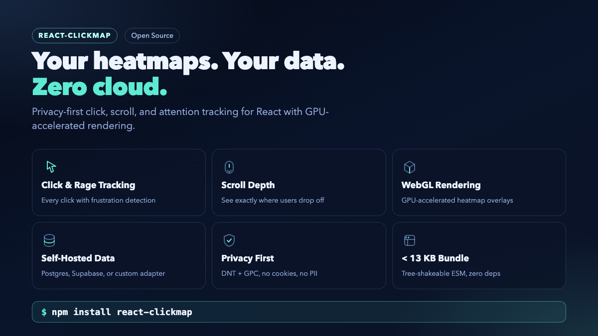
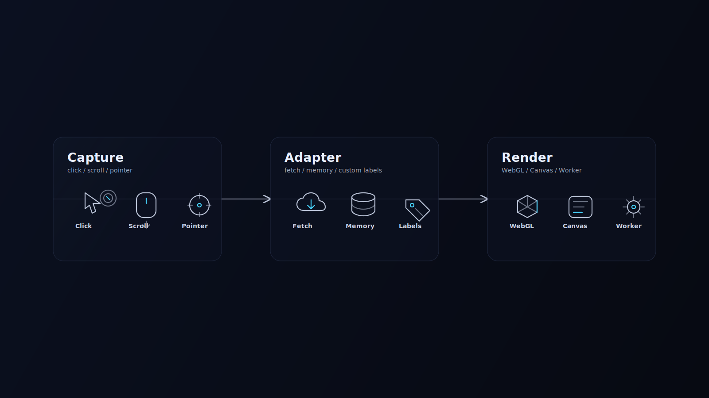

<p align="center">
  
</p>

<h1 align="center">react-clickmap</h1>

<p align="center">
  <strong>Privacy-first heatmaps for React. Your data, your database, zero cloud.</strong>
</p>

<p align="center">
  <a href="https://www.npmjs.com/package/react-clickmap"></a>
  <a href="https://www.npmjs.com/package/react-clickmap"></a>
  <a href="./LICENSE"></a>
  <a href="https://bundlephobia.com/package/react-clickmap"></a>
</p>

<p align="center">
  Capture clicks, scroll depth, pointer movement, rage clicks, and dead clicks.<br/>
  Render GPU-accelerated heatmap overlays. Ship changes based on real user behavior.<br/>
  <strong>No third-party analytics. No monthly bills. No session caps.</strong>
</p>

---

## Install

```bash
npm install react-clickmap
```

## Quickstart

```tsx
import { ClickmapProvider, Heatmap, fetchAdapter } from 'react-clickmap';

const adapter = fetchAdapter({ endpoint: '/api/clickmap' });

export function App() {
  return (
    <ClickmapProvider
      adapter={adapter}
      capture={['click', 'scroll', 'rage-click', 'dead-click']}
      sampleRate={0.25}
      respectDoNotTrack
      respectGlobalPrivacyControl
    >
      <YourApp />
      <Heatmap adapter={adapter} page="/pricing" type="heatmap" />
    </ClickmapProvider>
  );
}
```

That's it. Events are captured, batched, and persisted through your adapter. Render the overlay anywhere.

## Why react-clickmap?

<table>
<tr>
<td width="50%">

### The old way

- Pay $300+/mo for Hotjar, FullStory, or LogRocket
- Hit session caps and sampling limits
- Send your users' behavior data to third-party servers
- Fight with cookie consent banners
- Get vendor-locked into proprietary dashboards

</td>
<td width="50%">

### The react-clickmap way

- **Free and open source** — MIT licensed
- **Unlimited sessions** — no artificial caps
- **Self-hosted** — data stays in your Postgres/Supabase
- **Privacy-first** — respects DNT and GPC out of the box
- **React-native** — components, not script tags

</td>
</tr>
</table>

## Features

<p align="center">
  
</p>

### Capture

| Event Type | Description |
|---|---|
| **Click** | Every click with viewport-relative coordinates |
| **Rage Click** | Rapid repeated clicks on the same target — UX frustration signal |
| **Dead Click** | Clicks on non-interactive elements — layout confusion signal |
| **Scroll Depth** | How far users scroll, with max-depth tracking |
| **Pointer Move** | Mouse/touch movement for attention heatmaps |

### Render

| Component | Purpose |
|---|---|
| `<Heatmap>` | Full-page heatmap, clickmap, or scrollmap overlay |
| `<AttentionHeatmap>` | Pointer-move attention visualization |
| `<ScrollDepth>` | Horizontal scroll-depth bands |
| `<ComparisonHeatmap>` | Side-by-side A/B heatmap comparison |
| `<HeatmapThumbnail>` | Mini heatmap preview cards |
| `<ElementClickOverlay>` | Per-element click count badges |

### Rendering Engine

- **WebGL-first** with automatic Canvas fallback
- 3-tier capability detection (WebGL2 > WebGL1 > Canvas2D)
- GPU-accelerated radial gradient blending
- Handles context loss/restore gracefully
- Gradient palette memoization for consistent colors

### Privacy

```tsx
<ClickmapProvider
  respectDoNotTrack        // Honors navigator.doNotTrack
  respectGlobalPrivacyControl  // Honors navigator.globalPrivacyControl
  sampleRate={0.25}        // Only capture 25% of sessions
  maskSelectors={['.pii-field', '[data-sensitive]']}
/>
```

No cookies. No fingerprinting. No PII collection. Fully GDPR/CCPA compatible.

## Architecture

```
Browser                         Your Server
┌─────────────────┐             ┌──────────────────┐
│  ClickmapProvider│            │  API endpoint     │
│  ├─ Click tracker│  ──batch──▶│  ├─ Postgres      │
│  ├─ Scroll tracker│           │  ├─ Supabase      │
│  ├─ Pointer tracker│          │  └─ Custom adapter │
│  └─ Event batcher │          └──────────────────┘
│                   │                    │
│  Heatmap / Overlay│  ◀──load────────────┘
└─────────────────┘
```

<p align="center">
  
</p>

## Ecosystem

| Package | Description |
|---|---|
| [`react-clickmap`](packages/react-clickmap) | Core library — capture engine, adapters, rendering components |
| [`react-clickmap-postgres`](packages/react-clickmap-postgres) | Postgres persistence adapter with parameterized queries |
| [`react-clickmap-supabase`](packages/react-clickmap-supabase) | Supabase adapter — zero backend code needed |
| [`@react-clickmap/next`](packages/react-clickmap-next) | Next.js helpers — App Router API routes and server components |
| [`@react-clickmap/dashboard`](packages/react-clickmap-dashboard) | Pre-built analytics dashboard components |
| [`react-clickmap-cli`](packages/react-clickmap-cli) | Local preview CLI — visualize heatmaps without deploying |

## Persistence

The core library is storage-agnostic. Use a built-in adapter or write your own:

### Option 1: Postgres (recommended)

```bash
npm install react-clickmap-postgres
```

```ts
import { createPostgresAdapter } from 'react-clickmap-postgres';

const adapter = createPostgresAdapter({
  sql: pool, // any object with query(text, params) => { rows, rowCount }
});
```

### Option 2: Supabase

```bash
npm install react-clickmap-supabase
```

```ts
import { createSupabaseAdapter } from 'react-clickmap-supabase';

const adapter = createSupabaseAdapter({
  url: process.env.SUPABASE_URL,
  anonKey: process.env.SUPABASE_ANON_KEY,
});
```

### Option 3: Custom adapter

```ts
const adapter = createAdapter({
  save: async (events) => { /* your logic */ },
  load: async (query) => { /* your logic */ },
});
```

## Next.js Integration

```bash
npm install @react-clickmap/next
```

Works with the App Router out of the box. See the [Next.js guide](apps/docs/content/guides/nextjs-app-router.md) for setup details.

## Bundle Size

The core library ships under **13 KB** gzipped. Tree-shakeable ESM-only build — you only pay for what you import.

## Documentation

| Topic | Link |
|---|---|
| Getting Started | [`apps/docs/content/getting-started.md`](apps/docs/content/getting-started.md) |
| Privacy & Consent | [`apps/docs/content/guides/privacy-consent.md`](apps/docs/content/guides/privacy-consent.md) |
| Persistence Guide | [`apps/docs/content/guides/persistence.md`](apps/docs/content/guides/persistence.md) |
| Next.js App Router | [`apps/docs/content/guides/nextjs-app-router.md`](apps/docs/content/guides/nextjs-app-router.md) |
| Rendering Performance | [`apps/docs/content/guides/rendering-performance.md`](apps/docs/content/guides/rendering-performance.md) |
| API: Components | [`apps/docs/content/api/components.md`](apps/docs/content/api/components.md) |
| API: Adapters | [`apps/docs/content/api/adapters.md`](apps/docs/content/api/adapters.md) |
| API: Events | [`apps/docs/content/api/events.md`](apps/docs/content/api/events.md) |

## Launch Video

[](assets/launch-video.mp4)

## Contributing

```bash
git clone https://github.com/btahir/react-clickmap.git
cd react-clickmap
npm install
npm run build
npm test
```

## License

[MIT](./LICENSE) — free for personal and commercial use.
