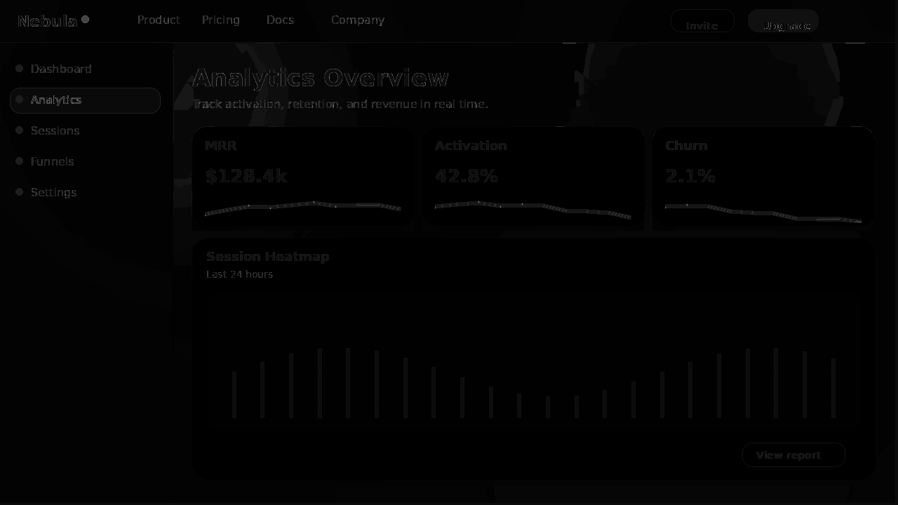
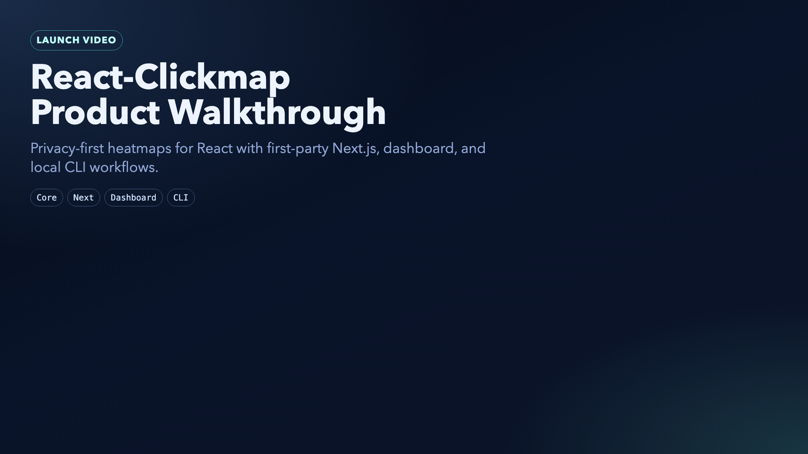

# react-clickmap

[](https://www.npmjs.com/package/react-clickmap)
[](./LICENSE)
[](https://www.npmjs.com/package/react-clickmap)

Privacy-first heatmaps for React. Your data, your database, zero cloud.

`react-clickmap` captures click, scroll, and pointer-move behavior and renders heatmap overlays without sending data to third-party analytics vendors.



## Product Media

- Hero poster: [`assets/readme-hero-poster.png`](assets/readme-hero-poster.png)
- Launch video (MP4): [`assets/launch-video.mp4`](assets/launch-video.mp4)
- Launch thumbnail: [`assets/launch-thumbnail.png`](assets/launch-thumbnail.png)

[](assets/launch-video.mp4)

## Current Status

- Monorepo foundation and release tooling are in place.
- Capture engine is implemented with privacy controls, sampling, batching, and adapter abstraction.
- Built-in adapters: `memoryAdapter`, `fetchAdapter`, `localStorageAdapter`.
- First-party SQL persistence add-on: `react-clickmap-postgres`.
- First-party Supabase persistence add-on: `react-clickmap-supabase`.
- First-party Next.js helpers: `@react-clickmap/next`.
- First-party analytics UI package: `@react-clickmap/dashboard`.
- First-party local preview CLI: `react-clickmap-cli`.
- Baseline visualization components are implemented:
  - `Heatmap`
  - `ScrollDepth`
  - `HeatmapThumbnail`
- Rendering supports capability-tier fallback (WebGL preferred, Canvas fallback).

## Install

```bash
pnpm add react-clickmap
```

## Quickstart

```tsx
import { ClickmapProvider, Heatmap, fetchAdapter } from 'react-clickmap';

const adapter = fetchAdapter({ endpoint: '/api/clickmap' });

export function App() {
  return (
    <ClickmapProvider
      adapter={adapter}
      capture={['click', 'scroll', 'rage-click']}
      sampleRate={0.25}
      respectDoNotTrack
      respectGlobalPrivacyControl
    >
      <YourApp />
      <Heatmap adapter={adapter} page="/pricing" type="heatmap" />
    </ClickmapProvider>
  );
}
```

## Package Layout

- Library: `packages/react-clickmap`
- Next.js add-on: `packages/react-clickmap-next`
- Dashboard add-on: `packages/react-clickmap-dashboard`
- Postgres add-on: `packages/react-clickmap-postgres`
- Supabase add-on: `packages/react-clickmap-supabase`
- Local preview CLI: `packages/react-clickmap-cli`
- Docs scaffold: `apps/docs`

## Docs

- Docs IA and authored content index: `apps/docs/README.md`
- Getting started: `apps/docs/content/getting-started.md`
- Guides:
  - `apps/docs/content/guides/privacy-consent.md`
  - `apps/docs/content/guides/nextjs-app-router.md`
  - `apps/docs/content/guides/persistence.md`
  - `apps/docs/content/guides/rendering-performance.md`
  - `apps/docs/content/guides/differentiation-packages.md`
- API:
  - `apps/docs/content/api/components.md`
  - `apps/docs/content/api/adapters.md`
  - `apps/docs/content/api/events.md`
- Examples:
  - `apps/docs/content/examples/element-overlay.md`
  - `apps/docs/content/examples/export-heatmap.md`

## Development

```bash
pnpm install
pnpm check
pnpm test:run
pnpm build
pnpm --filter @react-clickmap/media run render:all
```

## Roadmap

See [issues](https://github.com/btahir/react-clickmap/issues) for active milestones and feature tracking.
